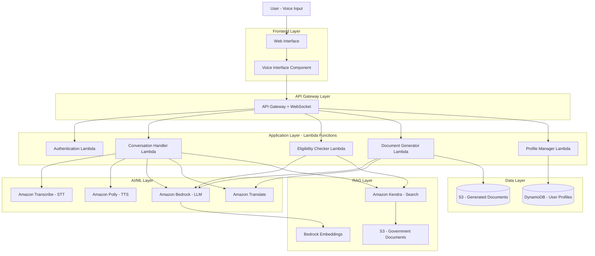

# Design Document: SAHAYAK AI

## Overview

SAHAYAK AI is a serverless, voice-first AI assistant built on AWS that helps rural Indian citizens discover government welfare schemes, check eligibility, and complete applications with step-by-step guidance. The system uses Retrieval Augmented Generation (RAG) to ensure all responses come from verified government sources, supports 5 Indian languages, and is optimized for low-bandwidth environments.

### Key Design Principles

1. **Voice-First**: Speech is the primary input/output modality
2. **Verified Information Only**: RAG-based architecture ensures responses come only from official government sources
3. **Multilingual**: Native support for Kannada, Hindi, Tamil, Telugu, and English
4. **Low-Bandwidth Optimized**: Lightweight responses and compressed audio for rural connectivity
5. **Privacy-Preserving**: Minimal data storage, no sensitive identifiers, user consent required
6. **Serverless**: Cost-effective, auto-scaling architecture suitable for variable usage patterns

## Architecture

### High-Level Architecture



### AWS Services Selection

**Compute:**
- **AWS Lambda**: Serverless compute for all business logic (conversation handling, eligibility checking, document generation, profile management)
- **API Gateway**: REST API and WebSocket API for real-time voice streaming

**AI/ML Services:**
- **Amazon Transcribe**: Speech-to-text with support for Hindi, Tamil, Telugu (Kannada via custom vocabulary)
- **Amazon Polly**: Text-to-speech with neural voices for all 5 languages
- **Amazon Bedrock**: LLM for conversation understanding and response generation (Claude 3 Sonnet recommended)
- **Amazon Translate**: Translation between supported languages
- **Amazon Kendra**: Intelligent search over government documents with RAG capabilities

**Storage:**
- **Amazon S3**: Store government PDFs, generated documents, and audio files
- **Amazon DynamoDB**: Store user profiles, conversation history, and session state

**Security:**
- **AWS Cognito**: User authentication and authorization
- **AWS KMS**: Encryption key management for sensitive data
- **AWS Secrets Manager**: Store API keys and credentials

**Monitoring:**
- **Amazon CloudWatch**: Logging, metrics, and alarms
- **AWS X-Ray**: Distributed tracing for debugging

### Data Flow

**Voice Interaction Flow:**
1. User speaks into web interface
2. Audio streamed to API Gateway WebSocket
3. Conversation Handler Lambda receives audio chunks
4. Amazon Transcribe converts speech to text (with language detection)
5. Text sent to Bedrock LLM with RAG context from Kendra
6. Kendra retrieves relevant passages from government documents in S3
7. Bedrock generates response using only retrieved context
8. Response translated if needed (Amazon Translate)
9. Amazon Polly converts text to speech
10. Audio streamed back to user via WebSocket

**Eligibility Check Flow:**
1. User provides profile information via voice
2. Profile Manager Lambda stores/retrieves profile from DynamoDB
3. Eligibility Checker Lambda queries Kendra for scheme criteria
4. Lambda applies criteria logic to user profile
5. Result with explanation returned to user

**Document Generation Flow:**
1. User requests document type (application, grievance, RTI, complaint)
2. Document Generator Lambda retrieves template from S3
3. Lambda uses Bedrock to fill template with user profile data
4. Document translated to user's language if needed
5. Generated document stored in S3 with temporary access link
6. Link provided to user for download

## Components and Interfaces

### 1. Voice Interface Component (Frontend)

**Responsibility:** Capture user voice input, stream audio, play responses, handle UI state

**Key Functions:**
- `startRecording()`: Begin capturing audio from microphone
- `stopRecording()`: End audio capture and send to backend
- `streamAudio(audioChunks)`: Stream audio in real-time via WebSocket
- `playResponse(audioUrl)`: Play TTS audio response
- `displayTranscript(text)`: Show text transcript for accessibility
- `toggleLowBandwidthMode()`: Switch between normal and low-bandwidth modes

**Interfaces:**
- WebSocket connection to API Gateway for bidirectional audio streaming
- REST API calls for profile management and document downloads

### 2. Conversation Handler Lambda

**Responsibility:** Orchestrate conversation flow, manage context, coordinate AI services

**Key Functions:**
- `handleVoiceInput(audioStream, sessionId, language)`: Process incoming audio
- `transcribeAudio(audioStream, language)`: Convert speech to text using Transcribe
- `detectLanguage(text)`: Identify language if not specified
- `retrieveContext(query, sessionId)`: Get relevant documents from Kendra
- `generateResponse(query, context, conversationHistory)`: Use Bedrock to generate response
- `synthesizeSpeech(text, language)`: Convert response to audio using Polly
- `compressForLowBandwidth(audio)`: Optimize audio for slow connections

**Input:**
```json
{
  "sessionId": "string",
  "audioChunk": "base64-encoded-audio",
  "language": "hi|kn|ta|te|en",
  "lowBandwidthMode": "boolean",
  "userId": "string"
}
```

**Output:**
```json
{
  "transcript": "string",
  "response": "string",
  "audioUrl": "string",
  "sources": ["document-id-1", "document-id-2"],
  "confidence": "float"
}
```

### 3. Eligibility Checker Lambda

**Responsibility:** Determine scheme eligibility based on user profile and scheme criteria

**Key Functions:**
- `checkEligibility(userId, schemeId)`: Main eligibility determination
- `retrieveSchemeCriteria(schemeId)`: Get criteria from Kendra
- `getUserProfile(userId)`: Fetch profile from DynamoDB
- `evaluateCriteria(profile, criteria)`: Apply eligibility logic
- `generateExplanation(result, criteria, profile)`: Create human-readable explanation
- `suggestAlternatives(profile)`: Find alternative schemes if ineligible

**Input:**
```json
{
  "userId": "string",
  "schemeId": "string",
  "schemeName": "string"
}
```

**Output:**
```json
{
  "eligible": "boolean",
  "explanation": "string",
  "missingCriteria": ["criterion-1", "criterion-2"],
  "alternativeSchemes": [
    {
      "schemeId": "string",
      "schemeName": "string",
      "matchScore": "float"
    }
  ]
}
```

**Eligibility Logic:**
```
For each criterion in scheme criteria:
  - Extract required field from user profile
  - Compare using criterion operator (>, <, =, IN, NOT IN)
  - Track which criteria pass/fail
  
If all criteria pass:
  - Return eligible = true with explanation
Else:
  - Return eligible = false with missing criteria
  - Query Kendra for schemes matching user's passing criteria
  - Return top 3 alternatives
```

### 4. Document Generator Lambda

**Responsibility:** Generate formatted documents in user's language

**Key Functions:**
- `generateApplicationLetter(userId, schemeId, language)`: Create application letter
- `generateGrievanceLetter(userId, grievanceDetails, language)`: Create grievance
- `generateRTIDraft(userId, rtiDetails, language)`: Create RTI request
- `generateComplaintDraft(userId, complaintDetails, language)`: Create complaint
- `fillTemplate(template, userData)`: Populate template with user data
- `translateDocument(document, targetLanguage)`: Translate if needed
- `storeDocument(document, userId)`: Save to S3 with temporary access

**Input:**
```json
{
  "userId": "string",
  "documentType": "application|grievance|rti|complaint",
  "schemeId": "string (for application)",
  "details": "object (for grievance/rti/complaint)",
  "language": "hi|kn|ta|te|en"
}
```

**Output:**
```json
{
  "documentUrl": "string (S3 presigned URL)",
  "documentId": "string",
  "expiresAt": "timestamp",
  "preview": "string (first 200 chars)"
}
```

**Document Templates:**
- Stored in S3 as JSON with placeholders: `{{user.name}}`, `{{scheme.name}}`, etc.
- Bedrock used to generate natural language content for variable sections
- Templates available in all 5 languages

### 5. Profile Manager Lambda

**Responsibility:** Manage user profile data with privacy controls

**Key Functions:**
- `createProfile(userId, profileData, consent)`: Create new profile
- `getProfile(userId)`: Retrieve profile
- `updateProfile(userId, updates)`: Update specific fields
- `deleteProfile(userId)`: Permanently delete profile
- `validateProfileData(profileData)`: Ensure data completeness and format
- `encryptSensitiveFields(profileData)`: Encrypt before storage

**Input (Create/Update):**
```json
{
  "userId": "string",
  "profile": {
    "state": "string",
    "income": "number",
    "casteCategory": "General|OBC|SC|ST|EWS",
    "age": "number",
    "hasDisability": "boolean",
    "disabilityType": "string (optional)",
    "education": "string",
    "occupation": "string"
  },
  "consent": "boolean"
}
```

**Output:**
```json
{
  "success": "boolean",
  "profileId": "string",
  "message": "string"
}
```

**DynamoDB Schema:**
```
Table: UserProfiles
Partition Key: userId (String)
Attributes:
  - state (String)
  - income (Number)
  - casteCategory (String)
  - age (Number)
  - hasDisability (Boolean)
  - disabilityType (String)
  - education (String)
  - occupation (String)
  - consentGiven (Boolean)
  - createdAt (Timestamp)
  - updatedAt (Timestamp)
  - ttl (Number) - Auto-delete after 90 days of inactivity
```

### 6. RAG System (Amazon Kendra)

**Responsibility:** Retrieve relevant passages from government documents

**Configuration:**
- **Data Source:** S3 bucket containing government PDFs and HTML content
- **Index:** Custom Kendra index with metadata fields (scheme_name, state, category, last_updated)
- **Query:** Natural language queries in any supported language
- **Response:** Top 5 relevant passages with source attribution

**Document Metadata:**
```json
{
  "scheme_name": "string",
  "state": "string",
  "category": "agriculture|health|education|housing|pension|other",
  "source_url": "string",
  "last_updated": "date",
  "language": "hi|kn|ta|te|en"
}
```

**Kendra Query Process:**
1. User query translated to English if needed
2. Kendra searches indexed documents
3. Returns passages with relevance scores
4. Passages filtered to only include confidence > 0.7
5. Source documents tracked for citation

## Data Models

### User Profile

```typescript
interface UserProfile {
  userId: string;
  state: string;
  income: number;
  casteCategory: 'General' | 'OBC' | 'SC' | 'ST' | 'EWS';
  age: number;
  hasDisability: boolean;
  disabilityType?: string;
  education: string;
  occupation: string;
  consentGiven: boolean;
  createdAt: Date;
  updatedAt: Date;
}
```

### Scheme

```typescript
interface Scheme {
  schemeId: string;
  schemeName: string;
  description: string;
  state: string;
  category: string;
  eligibilityCriteria: EligibilityCriterion[];
  benefits: string[];
  applicationSteps: ApplicationStep[];
  requiredDocuments: Document[];
  sourceUrl: string;
  lastUpdated: Date;
}

interface EligibilityCriterion {
  field: string; // e.g., "age", "income", "state"
  operator: '>' | '<' | '=' | 'IN' | 'NOT_IN';
  value: any;
  description: string;
}

interface ApplicationStep {
  stepNumber: number;
  description: string;
  commonMistakes: string[];
}

interface Document {
  documentName: string;
  description: string;
  isMandatory: boolean;
}
```

### Conversation Session

```typescript
interface ConversationSession {
  sessionId: string;
  userId: string;
  language: string;
  lowBandwidthMode: boolean;
  conversationHistory: Message[];
  currentContext: string;
  startedAt: Date;
  lastActivityAt: Date;
}

interface Message {
  role: 'user' | 'assistant';
  content: string;
  timestamp: Date;
  audioUrl?: string;
  sources?: string[];
}
```

### Generated Document

```typescript
interface GeneratedDocument {
  documentId: string;
  userId: string;
  documentType: 'application' | 'grievance' | 'rti' | 'complaint';
  schemeId?: string;
  content: string;
  language: string;
  s3Key: string;
  createdAt: Date;
  expiresAt: Date;
}
```

## Correctness Properties

*A property is a characteristic or behavior that should hold true across all valid executions of a system—essentially, a formal statement about what the system should do. Properties serve as the bridge between human-readable specifications and machine-verifiable correctness guarantees.*


### Property 1: Multilingual Speech-to-Text Accuracy
*For any* valid audio input in Kannada, Hindi, Tamil, Telugu, or English, the Voice_Interface should correctly identify the language and produce a text transcription in that language.
**Validates: Requirements 1.1**

### Property 2: Multilingual Text-to-Speech Generation
*For any* text input in Kannada, Hindi, Tamil, Telugu, or English, the Voice_Interface should generate valid audio output in the specified language.
**Validates: Requirements 1.2**

### Property 3: Language Switching Consistency
*For any* conversation session, when the user switches from language A to language B, all subsequent responses should be in language B until another switch occurs.
**Validates: Requirements 1.3**

### Property 4: Low-Bandwidth Audio Compression
*For any* audio content, when Low_Bandwidth_Mode is enabled, the audio file size should be smaller than the same content in normal mode.
**Validates: Requirements 1.5, 7.2**

### Property 5: Scheme Discovery Relevance
*For any* user query about needs or problems, all returned schemes should have relevance to the query (contain related keywords or categories).
**Validates: Requirements 2.1**

### Property 6: Scheme Ranking and Completeness
*For any* query that returns multiple schemes, the results should be ordered by relevance score (descending) and each scheme should include name, description, and benefits.
**Validates: Requirements 2.2, 2.4**

### Property 7: Verified Source Attribution
*For all* responses containing scheme information, application guidance, or eligibility criteria, the information should be retrieved from Verified_Sources and include source citations.
**Validates: Requirements 2.5, 4.5, 6.1, 6.3**

### Property 8: No Hallucination on Missing Information
*For any* query where Verified_Sources do not contain relevant information, the system should refuse to answer rather than generate unverified information.
**Validates: Requirements 6.2**

### Property 9: Profile Data Validation
*For any* user profile data, all fields should be validated against expected formats and ranges, and invalid data should be rejected with clear error messages.
**Validates: Requirements 3.2, 9.5**

### Property 10: Eligibility Criteria Application
*For any* eligibility check, the criteria applied should be retrieved from Verified_Sources and match the specific scheme being checked.
**Validates: Requirements 3.3**

### Property 11: Eligibility Explanation Completeness
*For any* eligibility determination (eligible or ineligible), the explanation should reference the specific criteria that were evaluated and, for ineligible cases, list which criteria were not met.
**Validates: Requirements 3.4, 3.5**

### Property 12: Minimal Information Request
*For any* eligibility check with an incomplete profile, only the missing fields required for that specific scheme's criteria should be requested.
**Validates: Requirements 3.6**

### Property 13: Application Guidance Structure
*For any* scheme, application guidance should include a numbered list of steps, a complete document checklist with descriptions, and common mistakes (when available in source data), all in the user's selected language.
**Validates: Requirements 4.1, 4.2, 4.3**

### Property 14: Step-Specific Response Focus
*For any* query about a specific application step, the response should contain information only about that step and not other steps.
**Validates: Requirements 4.4**

### Property 15: Document Generation with Profile Data
*For any* document type (application, grievance, RTI, complaint) and user profile, the generated document should contain all provided profile information and be in the user's selected language.
**Validates: Requirements 5.1, 5.2, 5.4**

### Property 16: RTI Legal Format Compliance
*For any* generated RTI document, it should contain the required legal elements: applicant information, public authority address, information requested, and reference to RTI Act 2005.
**Validates: Requirements 5.3**

### Property 17: Placeholder Insertion for Missing Data
*For any* document generation with an incomplete profile, placeholders (e.g., "[YOUR NAME]", "[YOUR ADDRESS]") should be inserted for all missing required fields.
**Validates: Requirements 5.5**

### Property 18: Low-Bandwidth Response Length Limit
*For any* response generated when Low_Bandwidth_Mode is enabled, the text should not exceed 100 words.
**Validates: Requirements 7.1**

### Property 19: Low-Bandwidth Interaction Efficiency
*For any* task (scheme discovery, eligibility check, document generation), the number of user-system interactions required in Low_Bandwidth_Mode should be less than or equal to normal mode.
**Validates: Requirements 7.3**

### Property 20: Network Speed Detection and Suggestion
*For any* session where network speed is detected as slow (< 1 Mbps), the system should suggest enabling Low_Bandwidth_Mode.
**Validates: Requirements 7.5**

### Property 21: Consent Required for Storage
*For any* attempt to store user profile data, the operation should fail if explicit consent has not been provided.
**Validates: Requirements 8.1**

### Property 22: Sensitive Data Rejection
*For any* profile data containing Aadhaar numbers, bank account details, or other highly sensitive identifiers, the storage operation should be rejected.
**Validates: Requirements 8.2**

### Property 23: Data Encryption at Rest
*For all* stored user profile data in DynamoDB, the data should be encrypted using AWS KMS.
**Validates: Requirements 8.4**

### Property 24: Profile Deletion Completeness
*For any* user deletion request, all associated profile data, conversation history, and generated documents should be permanently removed from all storage systems.
**Validates: Requirements 8.5**

### Property 25: Profile Persistence Across Sessions
*For any* user with a saved profile, when they start a new session, their profile data should be automatically loaded and available for eligibility checks.
**Validates: Requirements 9.2, 9.4**

### Property 26: Partial Profile Updates
*For any* profile update operation, only the specified fields should be modified, and unspecified fields should retain their previous values.
**Validates: Requirements 9.3**

### Property 27: Conversation State Persistence
*For any* session where network connectivity is lost, the conversation state (history, context, user profile) should be saved and restored when connectivity resumes.
**Validates: Requirements 10.4**

### Property 28: Multilingual Error Messages
*For all* error conditions, the error message should be in the user's selected language and include suggested next steps.
**Validates: Requirements 10.5**

## Error Handling

### Error Categories and Responses

**1. Voice Recognition Errors**
- **Low Confidence Transcription** (confidence < 0.6):
  - Request user to repeat
  - Offer text input alternative
  - Suggest moving to quieter environment
  
- **Language Detection Failure**:
  - Ask user to explicitly select language
  - Default to English if no selection made
  
- **Audio Quality Issues**:
  - Provide feedback about audio quality
  - Suggest checking microphone permissions
  - Offer text-only mode

**2. RAG System Errors**
- **No Relevant Documents Found**:
  - Inform user that information is not available
  - Suggest alternative search terms
  - Offer to connect with human support
  - Never generate unverified information
  
- **Kendra Service Unavailable**:
  - Inform user of temporary issue
  - Suggest trying again in a few minutes
  - Provide cached responses if available
  
- **Low Confidence Results** (relevance < 0.7):
  - Inform user that results may not be accurate
  - Show results with confidence scores
  - Suggest refining the query

**3. Eligibility Check Errors**
- **Incomplete Profile**:
  - List specific missing fields
  - Explain why each field is needed
  - Allow user to provide information or skip
  
- **Invalid Profile Data**:
  - Specify which field is invalid
  - Provide expected format/range
  - Offer examples of valid values
  
- **Scheme Criteria Not Found**:
  - Inform user that eligibility cannot be determined
  - Provide scheme contact information
  - Suggest checking official portal

**4. Document Generation Errors**
- **Template Not Found**:
  - Provide generic template
  - Include instructions for manual completion
  
- **Translation Failure**:
  - Offer document in English
  - Provide option to download and translate externally
  
- **S3 Storage Failure**:
  - Display document in UI for copy-paste
  - Retry storage operation
  - Log error for investigation

**5. Network and Connectivity Errors**
- **Connection Lost During Conversation**:
  - Save conversation state to browser localStorage
  - Show "Reconnecting..." message
  - Restore state when connection resumes
  
- **Slow Network Detected**:
  - Automatically suggest Low_Bandwidth_Mode
  - Reduce response verbosity
  - Compress audio more aggressively
  
- **API Timeout**:
  - Retry request up to 3 times with exponential backoff
  - Inform user if all retries fail
  - Offer to save query for later

**6. Authentication and Authorization Errors**
- **Session Expired**:
  - Prompt user to re-authenticate
  - Preserve conversation context
  - Resume after re-authentication
  
- **Invalid Credentials**:
  - Clear error message
  - Offer password reset option
  - Limit retry attempts to prevent brute force

### Error Logging and Monitoring

All errors should be logged to CloudWatch with:
- Error type and message
- User ID (anonymized)
- Session ID
- Timestamp
- Request context (language, low-bandwidth mode, etc.)
- Stack trace (for system errors)

CloudWatch Alarms should be configured for:
- High error rate (> 5% of requests)
- RAG system failures
- Document generation failures
- Authentication failures

## Testing Strategy

### Dual Testing Approach

The testing strategy employs both unit tests and property-based tests to ensure comprehensive coverage:

**Unit Tests** focus on:
- Specific examples demonstrating correct behavior
- Edge cases (empty inputs, boundary values, special characters)
- Error conditions and fallback behaviors
- Integration points between components
- Specific scenarios from requirements (e.g., no search results, speech recognition failure)

**Property-Based Tests** focus on:
- Universal properties that hold for all inputs
- Comprehensive input coverage through randomization
- Invariants that must be maintained
- Round-trip properties (e.g., profile save/load)
- Metamorphic properties (e.g., language switching consistency)

Both approaches are complementary and necessary: unit tests catch concrete bugs and validate specific scenarios, while property tests verify general correctness across a wide range of inputs.

### Property-Based Testing Configuration

**Library Selection:**
- **Python**: Use `hypothesis` library for property-based testing
- **TypeScript/JavaScript**: Use `fast-check` library for property-based testing

**Test Configuration:**
- Each property test must run a minimum of 100 iterations
- Each test must reference its design document property in a comment
- Tag format: `# Feature: sahayak-ai, Property {number}: {property_text}`

**Example Property Test Structure (Python):**
```python
from hypothesis import given, strategies as st

# Feature: sahayak-ai, Property 15: Document Generation with Profile Data
@given(
    document_type=st.sampled_from(['application', 'grievance', 'rti', 'complaint']),
    profile=st.fixed_dictionaries({
        'name': st.text(min_size=1),
        'state': st.sampled_from(['Karnataka', 'Tamil Nadu', 'Telangana']),
        'age': st.integers(min_value=18, max_value=100)
    }),
    language=st.sampled_from(['hi', 'kn', 'ta', 'te', 'en'])
)
def test_document_contains_profile_data(document_type, profile, language):
    document = generate_document(document_type, profile, language)
    assert profile['name'] in document
    assert profile['state'] in document
    assert str(profile['age']) in document
```

### Test Coverage by Component

**Voice Interface Component:**
- Unit tests: Test specific audio formats, language detection edge cases
- Property tests: Properties 1, 2, 3, 4

**Conversation Handler Lambda:**
- Unit tests: Test specific conversation flows, error handling
- Property tests: Properties 5, 6, 7, 8, 28

**Eligibility Checker Lambda:**
- Unit tests: Test specific eligibility scenarios, edge cases
- Property tests: Properties 9, 10, 11, 12

**Document Generator Lambda:**
- Unit tests: Test specific document formats, template edge cases
- Property tests: Properties 15, 16, 17

**Profile Manager Lambda:**
- Unit tests: Test CRUD operations, consent validation
- Property tests: Properties 21, 22, 23, 24, 25, 26

**RAG System Integration:**
- Unit tests: Test specific queries, no-results scenarios
- Property tests: Properties 7, 8

**Low-Bandwidth Mode:**
- Unit tests: Test mode switching, fallback behaviors
- Property tests: Properties 18, 19, 20

**Error Handling:**
- Unit tests: Test all error scenarios from Error Handling section
- Property tests: Property 28

### Integration Testing

Integration tests should cover:
1. End-to-end voice interaction flow (speech → transcription → RAG → response → TTS)
2. Eligibility check flow (profile collection → criteria retrieval → evaluation → explanation)
3. Document generation flow (request → template retrieval → filling → translation → storage)
4. Profile management flow (create → save → load → update → delete)
5. Language switching mid-conversation
6. Low-bandwidth mode activation and behavior
7. Error recovery and fallback mechanisms

### Performance Testing

Performance benchmarks:
- Voice transcription latency: < 2 seconds for 10-second audio
- Response generation latency: < 3 seconds for typical queries
- Document generation: < 5 seconds for any document type
- Profile operations: < 500ms for CRUD operations
- RAG retrieval: < 2 seconds for typical queries

Load testing scenarios:
- 100 concurrent users
- 1000 requests per minute
- Sustained load for 1 hour

### Security Testing

Security tests should verify:
1. Encryption at rest (DynamoDB, S3)
2. Encryption in transit (HTTPS, WSS)
3. Sensitive data rejection (Aadhaar, bank accounts)
4. Consent enforcement
5. Data deletion completeness
6. Authentication and authorization
7. Input validation and sanitization
8. Rate limiting and DDoS protection

## MVP Implementation Plan

### Phase 1: Core Infrastructure (Week 1-2)
- Set up AWS account and services (Lambda, API Gateway, S3, DynamoDB, Cognito)
- Configure Kendra index with sample government documents
- Set up CI/CD pipeline
- Implement basic authentication

### Phase 2: Voice Interface (Week 3-4)
- Implement speech-to-text using Amazon Transcribe
- Implement text-to-speech using Amazon Polly
- Build web interface with audio recording/playback
- Support 2 languages initially (Hindi and English)

### Phase 3: RAG System (Week 5-6)
- Integrate Amazon Bedrock for LLM
- Implement RAG pipeline with Kendra
- Add source attribution and citation
- Implement "refuse to answer" logic for missing information

### Phase 4: Core Features (Week 7-9)
- Implement scheme discovery
- Implement eligibility checker
- Implement profile management
- Add remaining 3 languages (Kannada, Tamil, Telugu)

### Phase 5: Document Generation (Week 10-11)
- Create document templates
- Implement document generator lambda
- Add translation support
- Implement S3 storage with presigned URLs

### Phase 6: Optimization and Polish (Week 12-13)
- Implement low-bandwidth mode
- Add error handling and fallbacks
- Performance optimization
- Security hardening

### Phase 7: Testing and Launch (Week 14-15)
- Comprehensive testing (unit, property, integration)
- User acceptance testing with target users
- Documentation
- Production deployment

### MVP Scope Limitations

**Included in MVP:**
- Voice interface with 5 languages
- Scheme discovery and eligibility checking
- Document generation (all 4 types)
- Profile management with privacy controls
- Low-bandwidth mode
- RAG with verified sources only

**Excluded from MVP (Future Enhancements):**
- Direct submission to government portals
- Mobile app (web-only for MVP)
- Offline mode
- Multi-user family profiles
- Application status tracking
- SMS/WhatsApp integration
- Voice biometric authentication
- Advanced analytics and reporting

### Success Metrics

**User Engagement:**
- Daily active users
- Average session duration
- Queries per session
- Return user rate

**System Performance:**
- Response latency (p50, p95, p99)
- Error rate
- Transcription accuracy
- RAG relevance score

**User Satisfaction:**
- Task completion rate
- User feedback ratings
- Language preference distribution
- Low-bandwidth mode adoption

**Business Impact:**
- Number of schemes discovered
- Eligibility checks performed
- Documents generated
- Cost per user interaction
